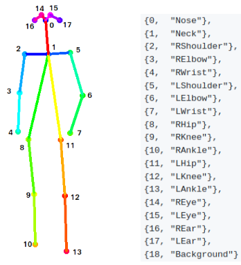
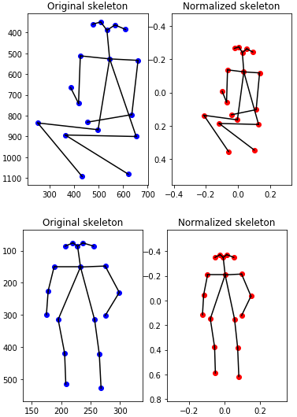
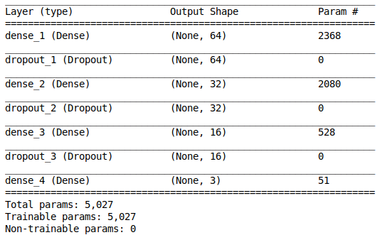

# I/ INTRODUCTION
This neural network was built to classify human poses (standing, bending and crouching) based on human skeleton information (key-points) produced by OpenPose. 


# II/ APPROACH
Human keypoints used in this neural network is produced by OpenPose. There are 18 key-points representing for human skeletons as described below:



For each person, the coordinates of the singular point in is obtained, where n is the joint number. The size of each human skeleton in a frame is varied due to camera distance and camera angle. To prepare the data for the input of the neural network, the coordinates are normalized relative to the body length and relative to the center of gravity.

##1. How to calculate length of body and center of gravity?

The Euclidean distance between two points (A, B) is defined as below:        
```python
      def euclidean_dist(a, b):
          # This function calculates the euclidean distance between 2 point in 2-D coordinates
          # if one of two points is (0,0), dist = 0
          # a, b: input array with dimension: m, 2
          # m: number of samples
          # 2: x and y coordinate
          try:
              if (a.shape[1] == 2 and a.shape == b.shape):
                  # check if element of a and b is (0,0)
                  bol_a = (a[:,0] != 0).astype(int)
                  bol_b = (b[:,0] != 0).astype(int)
                  dist = np.linalg.norm(a-b, axis=1)
                  return((dist*bol_a*bol_b).reshape(a.shape[0],1))
          except:
              print("[Error]: Check dimension of input vector")
              return 0
```

Since OpenPose does not always generate 18 key-points for each human in the frame because of occlusion or human skeleton cropping, some key-points representing the body part can be omitted (assigned to origin 0). We define the length of head as maximum number among distance from neck to ears, from neck to eyes, from nose to ears and from nose to eyes. This definition of length of head would reduce the probability that length of head is zero. 
```python
        length_head = maximum(E_dist(neck, eye), E_dist(neck, ear), E_dist(nose, eye), E_dist(nose, ear))
```
Length of torso is maximum of distance from neck to left and right hips:
```python
        length_torso = maximum(E_dist(neck, right_hip), E_dist(neck, left_hip))
 ```
Length of right and left legs are calculated as below formula:
 ```python
        length_right/left-leg = E_dist(hip, knee) + E_dist(knee, ankle)
```
Length of leg is defined as the maximum of length of right and left legs:
```python
        length_leg = maximum(length_left-leg, length_right-leg)
```
The length of human body is calculated as sum of length of head, length of torso and length of leg. 
```python
        length_body = length_head + length_torso + length_leg
```

The center of gravity is calculated as:


     
*where num_pts is the number of keypoints generated by Openpose (num_pts <= 18)*

Then the coordinate of each keypoint is normalized as:


Applying pre-processing process, the normalized key-points would be in the similar distribution as original key-points but in range of (-1, 1):



## 2. Neural Network
The normalized coordinates (jn(x) and jn(y)) will be fed into a neural network. Since the input size to neural network is small (size = 36 for 18 key-points), we construct a shallow network with 2 hidden layers for classification. We also apply dropout technique to reduce overfitting.
Neural network is built by Keras as summarized below:



## 3. Result

